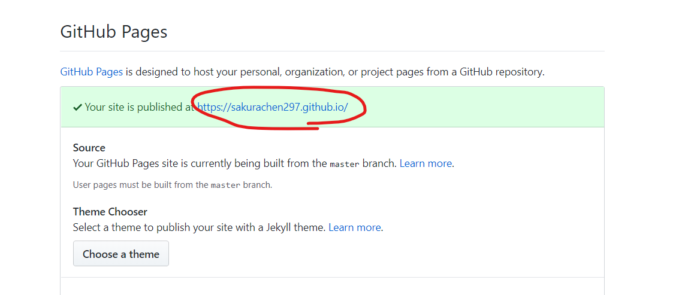

本博客将带来一次GitHub Pages预览HTML的小教程，教程的建立在你已经熟悉了一系列命令行的操作。

## 步骤如下：

1. 首先在GitHub中建立一个仓库，期间注意所有的选项都不要打勾哦！

2. 然后在你已经创建好的含有index.html的目录中打开VSCode。

3. 执行如下指令：


```bash
git init
git add .
git commit -m 'GithubPages预览HTML'
git remote add origin git@xxxxxx(此处应为你的仓库地址)
git push -u origin master
```


4. 接着，进入你的GitHub主页中，打开你的对应仓库，进入settings选项，往下翻动看到GitHub Pages一项，直接点击对应的网站便可打开你想预览的html了！

如图所示：
